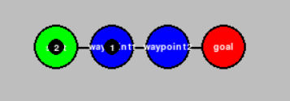
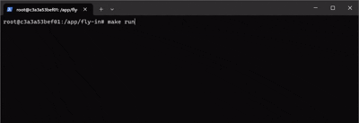
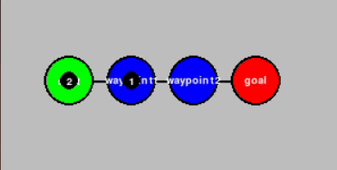

*This project has been created as part of the 42 curriculum by macamach*

# 1. Description
---

The **Fly-In** project is a simulation system designed to evaluate and optimize a **Multi-Agent Pathfinding (MAPF)** problem. 

The objective is to safely coordinate a fleet of autonomous drones across a network of zones (hubs) and interconnecting links (connections). The system must guide all drones from a designated **Start Hub** to an **End Hub** in the minimum number of simulation turns possible.

The main requirements are:
- Drones may move simultaneously
- Path conflicts and deadlocks are not allowed
- The simulation needs to meet zone and connection capacity constraints

## Zone Types and Costs

| Zone Type  |   Cost   |
| ---------- | -------- |
| NORMAL     |    1     |
| PRIORITY   |    1     |
| RESTRICTED |    2     |
| BLOCKED    | infinity |

Zones must respect the *max_drones* constraint  
**Tie-breaking rule**: Even though NORMAL and PRIORITY have the same cost, PRIORITY must take precedence over NORMAL whenever possible.

## Connections

Connections are bidirectional and must respect the *max_link_capacity* constraint.

## Visual Representation

The network topology and real-time drone movements are optionally rendered graphically. Components are color-coded based on the input configuration file and the following state rules:

- **Zones:** Each zone (Hub) is rendered using the custom color assigned within the network configuration file.
- **Connections:** Connections are rendered dynamically based on the type of the **destination zone**:

  - `BLACK`: When the next zone is a **NORMAL** zone.
  - `BLUE`: When the next zone is a **PRIORITY** zone.
  - `RED`: When the next zone is a **RESTRICTED** zone.
  - `GRAY`: When the next zone is a **BLOCKED** zone.

## Input file example

This is an example of a graphic network and the corresponding input network file configuration (.txt)




```text
nb_drones: 2

start_hub:  start       0 0 [color=green]
hub:        waypoint1   1 0 [color=blue]
hub:        waypoint2   2 0 [color=blue]
end_hub:    goal        3 0 [color=red]

connection: start-waypoint1
connection: waypoint1-waypoint2
connection: waypoint2-goal
 ``` 

## Output example

### Terminal Visualization

 A line lists all the drone movements that occur during each turn, space separated. Each movement follows the format: D`<ID>-<zone>`, or D`<ID>-<connection>` in case of drones still in flight toward restricted zones.

- D`<ID>` refers to the unique drone identifier (e.g., D1, D2).
- `<zone>` is the name of the destination zone.
- `<connection>` is the name of the connection toward a restricted zone (RESTRICTED zones cost 2 turns)
<br>



### GUI (pygame) Visualization



# 2. Instructions
---

## How to run a simulation
- Clone the repo
- Execute
    ```
        make install
        make run
    ```

## How to show GUI

Using a flag named **--gui-active** with the run rule, this flag name is given to an environment variable called **GUI_ACTIVE**

- Execute
   ```
        make run GUI_ACTIVE=--gui-active
    ```
and the GUI will be shown

## How to test all maps of the subject
- Execute
   ```
        make run ALL_MAPS=--all-maps
    ```
and a total of movements by map will be shown

## How to test a specific map

By default the simulation executes the maps given in the subject, to execute a specific map, you have to alter src/engine/main.py adding the map path to the list variable: **maps** in the main function.

## How to pass linters to the code
- Execute
   ```
        make lint
        make lint-strict
    ```

## How to run in debugger mode
- Execute
   ```
        make debug
    ```

## How to clean cache files
- Execute
   ```
        make clean
    ```

# 3. Resources & Dependencies
---

This project relies on a combination of Python's Standard Library and external packages to manage routing optimization, data validation, and graphical rendering.

### 📦 External Packages (Require installation via `requirements.txt`)
- **Pydantic:** An external data validation and settings management library. It is strictly used to enforce data models and ensure robust map parser validation.
- **Pygame:** An external multimedia library used to render the real-time 2D graphical visualization of the simulation, nodes, and network connections.
- **Flake8 & Mypy:** External code quality tools required by the project specifications to serve as linters and static type checkers.

### ⚙️ Python Standard Library (Native - No installation required)
- **argparse:** A native CLI argument-parsing module used to capture terminal flags (such as `--gui-active`) to dynamically enable or disable the graphic visualizer.
- **heapq:** A native module providing a binary heap algorithm. It serves as the heart of the core minimum-cost routing algorithm (Modified Dijkstra). It keeps path evaluation states sorted, ensuring that popping from the queue always yields the minimum-cost item (structured as tuples).
- **re (Regular Expressions):** A native module used as an optimal solution for parsing flexible network configuration files. It provides a simple and feasible way to extract hub and connection metadata where the presence and quantity of attributes are variable.